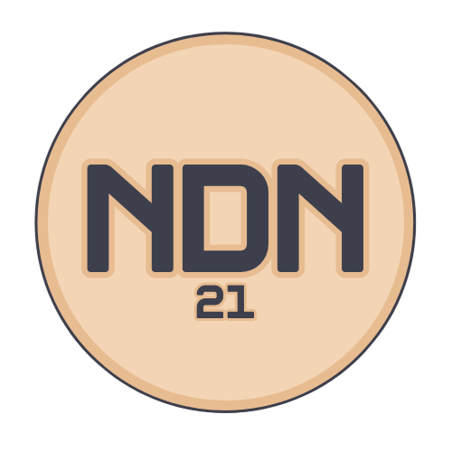
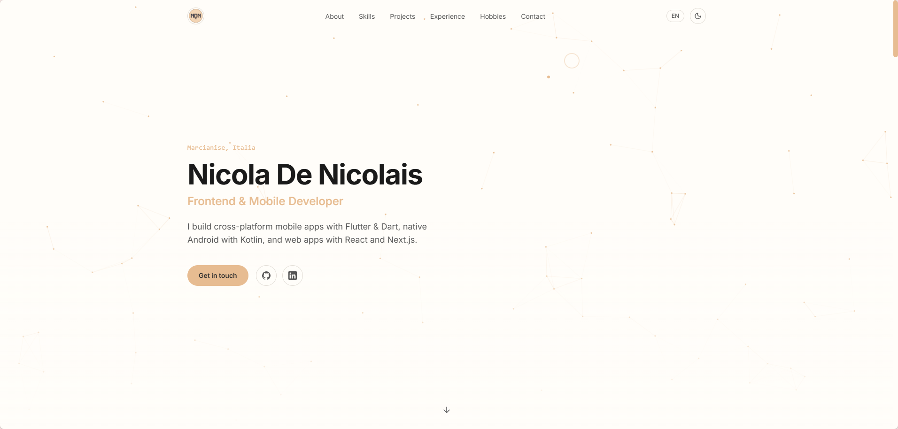

<div align="center">



# Nicola De Nicolais — Portfolio

**A personal portfolio website, built with Next.js and Tailwind CSS.**

Bilingual (EN/IT) profile with skills, projects, experience and a downloadable CV.<br>
Also hosts the public homepage and privacy policy of my published apps.

[](https://ndenicolais.github.io)
[](https://github.com/ndenicolais/ndenicolais.github.io/actions/workflows/deploy.yml)
[](https://nextjs.org)
[](LICENSE.md)

[**🌐 Visit the website**](https://ndenicolais.github.io) · [Features](#features) · [Documentation](DOCUMENTATION.md) · [Setup](SETUP.md)

<br>



</div>

---

## Features

| | |
|---|---|
| 🌍 **Bilingual** | English and Italian content, English by default |
| 🌗 **Theme** | Light / Dark theme |
| 🎨 **Skills** | Skills section with an icon for every technology |
| 🗂️ **Projects** | Projects filterable by category (Flutter, Kotlin, React) |
| 📄 **CV** | Downloadable PDF CV from the Contact section |
| 🖱️ **Interactive background** | Custom cursor and particle field, respecting `prefers-reduced-motion` |
| ✉️ **Contact form** | Messages sent through EmailJS, with a `mailto:` fallback |
| 🔍 **SEO** | Sitemap, robots.txt and a dynamically generated Open Graph image |
| 📱 **App pages** | Homepage and privacy policy for each published app |

---

## App pages

Each published app has a public homepage and privacy policy on this domain, used for the Google OAuth consent screen and as the Google Play privacy policy URL.

| App | Homepage | Privacy policy |
|---|---|---|
|  **Shox** | [ndenicolais.github.io/shox](https://ndenicolais.github.io/shox/) | [Privacy](https://ndenicolais.github.io/shox/privacy/) |
|  **QRation** | [ndenicolais.github.io/qration](https://ndenicolais.github.io/qration/) | [Privacy](https://ndenicolais.github.io/qration/privacy/) |
|  **Fivelink** | [ndenicolais.github.io/fivelink](https://ndenicolais.github.io/fivelink/) | [Privacy](https://ndenicolais.github.io/fivelink/privacy/) |

---

## Architecture

| Layer | Technology |
|---|---|
| Framework | Next.js 16 (App Router, Turbopack) + React 19 |
| Language | TypeScript |
| Styling | Tailwind CSS v4 |
| Animations | Framer Motion, GSAP |
| Icons | lucide-react, react-icons (Simple Icons) |
| Contact form | EmailJS |
| Notifications | sonner |
| Hosting | GitHub Pages (static export, deployed by GitHub Actions) |

<details>
<summary><b>Project structure</b></summary>

```
src/
├── app/                       # App Router pages, metadata, sitemap, robots, global styles
│   ├── shox/                  # Shox homepage + privacy policy
│   ├── qration/               # QRation homepage + privacy policy
│   └── fivelink/              # Fivelink homepage + privacy policy
├── components/                # Page sections and interactive UI
├── content/                   # Privacy policies in Markdown (<slug>-privacy.md)
├── context/                   # Theme and language providers
└── lib/                       # Portfolio content (data.ts), app pages (apps.ts), Markdown parser
public/                        # Logo, images, CV
```

</details>

---

## Build from source

### Requirements

- Node.js 20 or later
- EmailJS keys in `.env.local` for the contact form (copy `.env.local.example`; optional, without them the form falls back to `mailto:`)

### Run

```bash
# Clone the repository
git clone https://github.com/ndenicolais/ndenicolais.github.io.git
cd ndenicolais.github.io

# Install dependencies
npm ci

# Run the development server on http://localhost:3000
npm run dev
```

`npm run build` creates the static export in `out/`; `npm run lint` runs ESLint. Every push to `main` is built and deployed to GitHub Pages by [`.github/workflows/deploy.yml`](.github/workflows/deploy.yml).

---

## Documentation

For the architecture, the app pages and the deployment, see [DOCUMENTATION.md](DOCUMENTATION.md).

---

## License

Copyright © 2026 Nicola De Nicolais.
Source code is released under the **MIT** license — see [LICENSE.md](LICENSE.md) for details.
Personal content (texts, CV, photos, logos and other assets) is all rights reserved and may not be reused without permission.

<div align="center">

Made by **Nicola De Nicolais** · [ndn21dev@gmail.com](mailto:ndn21dev@gmail.com) · [GitHub](https://github.com/ndenicolais)

</div>
